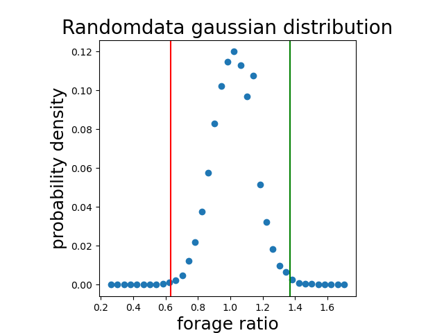
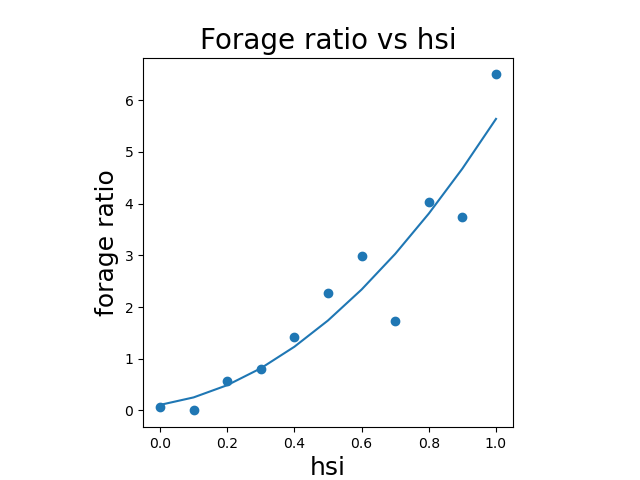
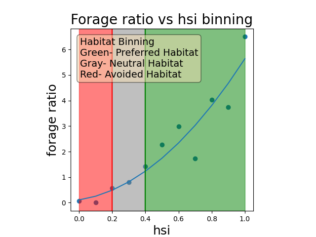
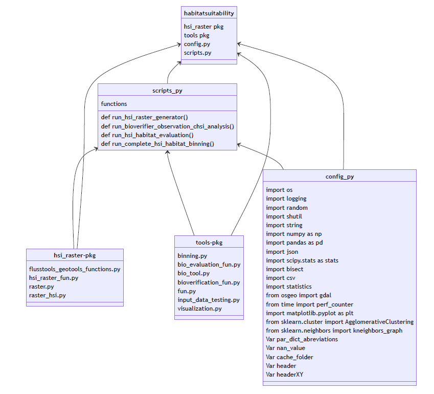
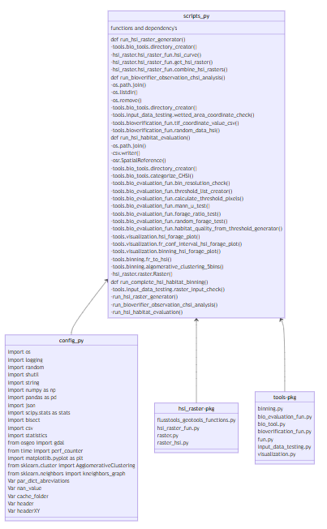
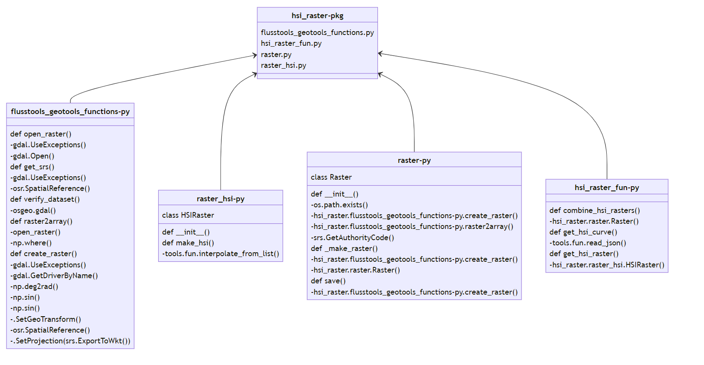
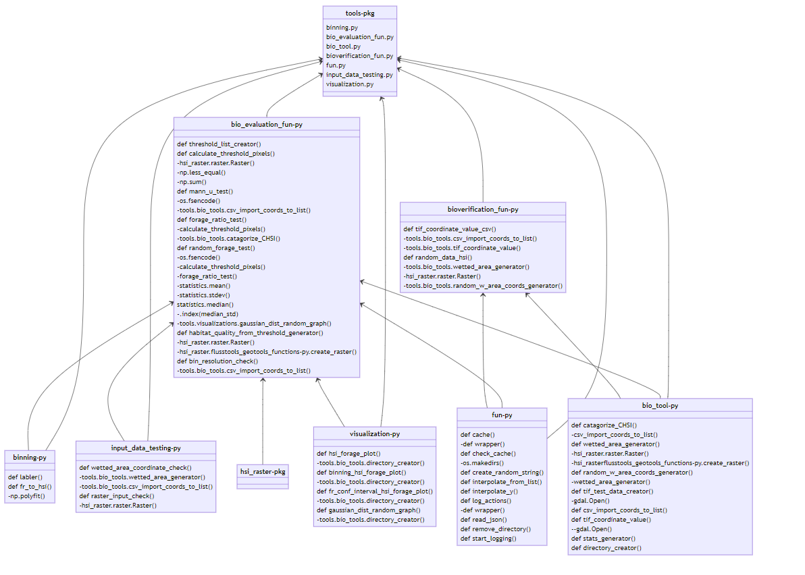

# Habitat-Suitability-Modeling-Docs

## Introduction
Habitat Suitability Modeling to generate HSI rasters, HSI Observation Data Evaluation,Random Observation Datas Generation, HSI Habitat Binning with Bootstrap Binning, and Binning Analysis
### Installation 
In your preferred python environment 

pip install habitatsuitability 

### Libraries
_Python Libraries:_  numpy, pandas, json, matplotlib, tkinter, bisect,time,scikit-learn,csv,GDAL,statistics

_Standard Libraries:_ os, logging, random, shutil, string

### Input Data

The following data must be provided to run the code for each step:

Step 1:Creating a habitat suitability index (hsi) raster for each parameter and a combined hsi raster
Inputs Needed:
1. tif raster files for each input parameter ex. velocity.tif
2. hsi curves json file for each input parameter

3. Step 2:Comparing the chsi raster with observation data
Inputs Needed:
4. csv xy coordinate observation data

Step 3: Creating habitat bins with bootstrap binning
 Inputs Needed:
5. Select a hsi bin resolution float ex. 0.1

Example data is available in the folder *example_inputs*
#### TIF Parameter Raster Data Input 
For the creation of parameter raster hsi raster parameter rasters are needed. 
It is imperative for each of the input rasters to have the same exact projection, size, origin, etc!
If one or more of the data raster does not share the same geo information data it needs to be modified using a gis software. 
First, convert the rasters so that they share the same projection. Next to create uniform origin and size, convert each of the rasters into a shapefile. 
Then using the shape files, create a shapefile mask of the available data extent using a clipping tool. 
Lastly, use the created available data extent shapefile mask to clip each of the parameter raster by the same extent. Make sure all extent setting are equal for each parameter raster.Often there is an option to copy the extent of other rasters.
This results in each parameter raster having the same extent, origin and size.
#### HSI Curve Data Json Files Input 
To convert an Excel HSI curve to a json file simply use an existing excel hsi curve and copy the columns into the website https://www.convertcsv.com/csv-to-json.htm.
Alternatively one can change the data of the input example json files. 
When labeling the rows make sure to have the first label represent the parameter abbreviation and the second HSI. As seen in the excel example below

Each json file needs to have the HSI value and the parameter abbreviation labeled. The order of the abbreviations u,h,d,o,o1,o2,o3 need to correspond with the parameter list. For simplicity use u as velocity, h as depth d, as substrate, o as other  velocity, depth,substrate,other respectively.
It is imperative that the order of the parameters list is the same as the labels of the abbreviations.  
Special notes:
- Make sure to have a value larger than any expected values and zero as largest and smallest parameter value equaling zero HSI in the json. If not done, it creates Nan Values inside hsi raster
  - The program interpolates between HSI curve points. To make a discrete change make use a parameter value sightly higher to create an almost vertical line. 

  
ex. Boolean which is HSI=1 between 12-15 HSI and  otherwise HSI = Zero 
    
      
      {
        "o1": 0,
        "HSI": 0
      },
      {
        "o1": 11.99,
        "HSI": 0
      },
      {
        "o1": 12,
        "HSI": 1
      },
      {
        "o1": 15.0,
        "HSI": 1
      },
      {
        "o1": 15.01,
        "HSI": 0
      },
      {
        "o1": 100,
        "HSI": 0
Example habitat suitability curve json files are available in *example_inputs/fish_hsc_json* 

#### Coordinate XY Observation Data Input
Before using the coordinates check if the projection used is the same as the raster data.
The format for the coordiantes should be a csv file with the first colum being the X coordinate and the second the y coordinate
Values will be vetted with the available data and wetted area with only valid coordinates being used for the analysis.

An example coordinate file can be seen below and is available in *example_inputs/input_bioverification_files/example_observation_data.csv*.

#### HSI Bin Resolution Selection Input
For the bootstrap binning method a hsi bin resolution value needs to be selected.A lower resolution bin value distinguishes hsi for bin selction with a finer precision but will also add more uncertainty.The bin resolution needs to be selected based on the amount of observation data points available.
The error is generated in the form of standard deviation of different random data sets forage ratios for the same hsi bin interval. 

A chart showing a sample raster with differing amounts of data points can be seen below.

This graph shows the standard deviation versus the bin resolution with differing amount of observation data points. Standard deviation needs to be below 0.4 for meaningful binning.If it is not below 0.4 the error erases the significance of the quality binning by not allowing for differentiation between real and randomly generated data.
For this reason a value should be selected with reference to this graph based on the number of observations available. It is also important that the variable is a factor of 1.0. In the default run there a minimum bin resolution size is checked and changed if it does not meet requirements.

ex. 1000 observations (selected bin resolution 0.05) or 100 observations (selected bin resolution 0.1)

#### Example input data
Example fictional inputs can be found in the *example_input* folder. 
This data is used as en example in to show a complete run in the *example_run.py* python file.
After pip installing the habitatsutiability package run the example file to see the example outputs.

### Outputs
1. hsi raster for each parameter
2. chsi raster from hsi rasters
3. list of coordinates with their respective chsi values
4. randomly picked datasets with their respective chsi values
5. habitat tif raster using bootstrap binning or costume binning hsi habitat thresholds
6. figures showing observation data hsi vs forage ratio , bootstrap binning, etc.
#### hsi/chsi raster
An hsi raster for each parameter and a combined hsi raster will be generated in a directory labeled *hsi_rasters* in the directory were the command was run from.
The output directory can be changed, but it is the default.
An example of a chsi raster can be seen below.

#### chsi coordinate list 

The observation coordinates are compared with the created chsi raster to find the chsi value at each coordinate location. The resulting csv file, with coordinates with the chsi value of the raster associated to it, is saved in current directory in the generated directory  *observation_chsi* by default.
An example of the output can be seen below.

#### randomly generated data sets 
Random datasets are procedurally picked to compare the chsi value with the real observation data. This data is stored in the generated directory *randomdatasets*. By default 1000 data sets will be generated, each containing the same amount of points as the valid observation points. They have the exact same format as the chsi observation dataset.

An example of the randomly generated data over the chsi raster is shown below.

#### habitat raster 
Through the creation of a chsi raster, the usage of the observation data, and the randomly picked data the bootstrap binning method is applied to distinguish habitat quality. In the habitat raster the higher number correlates with a better quality habitat. In the three bin habitat raster seen below  three is preferred habitat, two is neutral habitat, and one is avoided habitat.

*By default, the bootstrap binning method is used, however there is the options to add custom hsi thresholds for binning which overrides the automatic bin creation.

*1 is avoided habitat 2 is neutral and 3 is preferred habitat
#### Generated graphs
In the generated folder *generated graphs* a variety of graphs are automatically generated showing the analysis of the data. This includes a HSI vs. Forage Ratio scatter plot, random data gaussian distribution, hsi habitat classification and a few others.

Examples of the automaticaly generated graphs can be seen below:

### Instructions to run complete raster from 
1. Preprocess georaster data to have same origin and projection for all tif inputs
2. create/import csv file for x and y coordiantes of the observation data
2. create/import json file for hsi curves for all parameters
4. select bin resolution for bootstrap binning (decimal float)
5. run_complete_hsi_habitat_binning from habitatsuitability
    - for only hsi raster generation 
      - run_hsi_raster_generator()   
    - for only random data generation and observation data chsi value evaluation 
      - run_bioverifier_observation_chsi_analysis() **requires previous outputs of run_hsi_raster_generator()*
    - for only hsi habitat evaluation and generation of habitat tifs 
      - run_hsi_habitat_evaluation() **requires previous outputs of run_bioverifier_observation_chsi_analysis *
    
6. see the automaticly generated graphs, analysis results and open rasters in qgis

### Code Description
General process:
1. Checking of input rasters
2. Creation of combined hsi(chsi) raster and indivudial parameter hsi rasters 
3. Evaluate observation coordinate data with chsi raster 
4. Generate randomly picked data sets
5. Use randomly picked data sets to run bootstrap binning procedure
6. Create habitat tifs using determined bin quality thresholds

### Code Diagram Package Overview 

*Complete ulm code diagram pdf available in the images directory 
*images/full_ulm_code_diagram.pdf*
## Modules 
- scripts.py
- config.py
- tools pkg
- hsi_raster pkg
### scripts.py
#### function list
- run_hsi_raster_generator()
- run_bioverifier_observation_chsi_analysis()
- run_hsi_habitat_evaluation()
- run_complete_hsi_habitat_binning()
#### scripts ulm overview

#### run_hsi_raster_generator()
    def run_hsi_raster_generator(parameters = None,parameter_hsicurve_json_dict=None,tifs_dictionary = None,
         hsi_output_dir= os.path.abspath("") + "\\hsi_raster_tifs\\",par_dict=None):
    """
        Generates HSI rasters for each parameter using parameter tif input,json_hsc_curve.Then calclates a combined HSI raster with the HSI raster.
        :param parameters: list of string input parameters ex. ["velocity","depth","substrate"]
        :param parameter_hsicurve_json_dict: dictionary of parameters and their corresponing json files which contain the parameter hsi curve
        ex. paramaterhsicurve_json_dict = dict(velocity=velocity_hsicurve_json_path,depth=depth_hsicurve_json_path,substrate=substrate_hsicurve_json_path,other=other_hsicurve_json_path)
        :param tifs_dictionary: dictionary of parameters with their corresponding tif path
        ex. tif_inputs = {"velocity": os.path.abspath("") + "\\input_files\\input_parameter_tifs\\example_velocity.tif",
                  "depth": os.path.abspath("") + "\\input_files\\input_parameter_tifs\\example_depth.tif",
                  "substrate": os.path.abspath("") + "\\input_files\\input_parameter_tifs\\example_substrate.tif"}
        :param hsi_output_dir: output directory for hsi tifs (default hsi_output_dir= os.path.abspath("") + "\\hsi_raster_tifs\\")
        :param par_dict = dictionary of parameters and the abreviations optional input otherwise it is generated with parameter list and config  par_dict_abreviations
                ex.par_dict = {"velocity": "u","depth": "h","substrate": "d","other": "o"}
        :return: None
        *function modified from Sebastian Schwindt's https://github.com/Ecohydraulics/Exercise-geco
        """
#### run_bioverifier_observation_chsi_analysis()
    def run_bioverifier_observation_chsi_analysis(
        # mandatory
        observation_coordinate_csv_path=None,
        # optional
        chsi_tif_path=os.path.abspath("") + "\\hsi_raster_tifs\\chsi.tif",
        depth_tif_path=os.path.abspath("") + "\\hsi_raster_tifs\\hsi_depth.tif",

        random_datasets_quantity=10000,
        random_data_directory=os.path.abspath("") + "\\randomdatasets\\",
        observation_chsi_directory=os.path.abspath("") + "\\observation_chsi\\",
        wetted_area_test=True,
        coordinate_to_chsi_raster_value=True,
        generate_random_data_sets=True
    ):
        """
           Finds chsi value for each observation location,filters valid points, generates randomly picked datasets
           #mandatory
           :param observation_coordinate_csv_path:input path csv file of xy coordinates observation data
           #optional changes
           :param chsi_tif_path:input path tif file of chsi tif file. Saved by default from create_hsi-raster in (default:chsi_tif_path=os.path.abspath("") + "\\hsi_raster_tifs\\chsi.tif",)
           :param depth_tif_path:input path tif file of depth tif file. Saved by default from create_hsi-raster in (default:depth_tif_path=os.path.abspath("") + "\\hsi_raster_tifs\\hsi_depth.tif",)
           :param random_datasets_quantity:quantity of randomdatasets to be created (default:random_datasets_quantity=10000)
           :param random_data_directory:output directory path of random datasets(default:random_data_directory=os.path.abspath("") + "\\randomdatasets\\")
           :param observation_chsi_directory:output directory path of chsi observation data(default:observation_chsi_directory=os.path.abspath("") + "\\observation_chsi\\")
           :param wetted_area_test:bool enable wetted area test to include only valid observation coordinates (default:wetted_area_test=True)
           :param coordinate_to_chsi_raster_value:bool finds chsi value for each xy observation coordinate (default:coordinate_to_chsi_raster_value=True)
           :param generate_random_data_sets:bool generates random data sets(default:generate_random_data_sets=True)
           :return: None
"""
#### run_hsi_habitat_evaluation()
    def run_hsi_habitat_evaluation(
         bio_data_path=os.path.abspath("")+"\\observation_chsi\\observation_chsi_data.csv",
         bin_resolution=None,
         bootstrap_binning=True,
         custom_binning=False,
         custom_bin_thresholds=None,
         print_random_forage_results =True,
         agglomerativeclustering_binning=False,
         resolution_check=True,
         random_data_hsi_directory=os.path.abspath("") + "\\randomdatasets\\",
         chsi_raster_path = os.path.abspath("") + "\\hsi_raster_tifs\\chsi.tif",
         results_analysis_directory=os.path.abspath("") + "\\binning_analysis_results\\"):
    """
    Habitat binning uses the chsi and observation data to distinguish habitat quality in the form of chis thresholds bootstrap binning,
    generates habitat quality tifs, creates results analysis,and gives flexibility for custom binning options.

    #mandatory inputs
    :param bin_resolution: float decimal number giving the resolution bin size for the bootstrap binning analysis
    decimal options (0.25,0.2,0.1,0.05,0.04,0.02,0.01) needs to be a factor of 1, larger bin has less uncertainity but has lower resolution

    #optional inputs (if bioverifier_observation_chsi_analysis and hsi_raster_generator outputs were run on default
    :param bio_data_path: path of chsi observation data (default:random_data_hsi_directory=os.path.abspath("") + "\\randomdatasets\\")
    :param chsi_raster_path:path of chsi tif raster (default:chsi_raster_path = os.path.abspath("") + "\\hsi_raster_tifs\\chsi.tif")
    :param random_data_hsi_directory:directory path for random hsi data (default:random_data_hsi_directory=os.path.abspath("") + "\\randomdatasets\\")
    :param custom_bin_thresholds: list of custom bin thresholds ex.[.25,.5,.75,1], only generates if custom_binning is true

    #optional outputs
    :param results_analysis_directory:
    #options
    :param bootstrap_binning:bool enables bootstrap binning  (default:True)
    :param custom_binning:bool enables custom binning instead of bootstrap binning, if true needs custom_bin_threshold input (default:False)
    :param resolution_check:bool enables check of resolution prior to analysis and corrects if resolution bin size below minimum threshold(default:True)
    :param print_random_forage_results:bool creates csv file with random datasets forage ratio results  (default:True)
    :param agglomerativeclustering_binning:bool enables further categorization of bootstrap binning thresholds with agglomerative clustering results in 5 bins(default:False)

    """
#### run_complete_hsi_habitat_binning()
    def run_complete_hsi_habitat_binning(
       
        # mandatory inputs
            tifs_dictionary=None,  # Input test +create_hsi_raster
            parameters=None,  # create_hsi_raster
            depth_tif_path=None,
            parameter_hsicurve_json_dict=None,
            observation_coordinate_csv_path=None,  # bioverification
            bin_resolution=None,  # bio_evaluatiom

        # create_chsi_raster optionals
            par_dict=None,
            hsi_output_dir=os.path.abspath("") + "\\hsi_raster_tifs\\",
            
        # bioverification optional
            random_datasets_quantity=10000,
            chsi_tif_path=os.path.abspath("") + "\\hsi_raster_tifs\\chsi.tif",  # used in bio_evaluation
            random_data_directory=os.path.abspath("") + "\\randomdatasets\\",  # used in bio_evaluation
            observation_chsi_directory=os.path.abspath("") + "\\observation_chsi\\",  # used in bio_evaluation
            wetted_area_test=True,
            coordinate_to_chsi_raster_value=True,
            generate_random_data_sets=True,
        
            
        # bio_evaluation optionals
            bootstrap_binning=True,
            custom_binning=False, custom_bin_thresholds=None,
            print_random_forage_results=True,
            agglomerativeclustering_binning=False,
            resolution_check=True,
            random_data_hsi_directory=os.path.abspath("") + "\\randomdatasets\\",
            results_analysis_directory=os.path.abspath("") + "\\binning_analysis_results\\"):
    """

        Runs the complete process for CHSI creation,observation data evaluation,random data generation,Habitat Binning, and analysis. Runs raster_input_check,hsi_raster_generator
        ,bioverifier_observation_chsi_analysis, and habitat_binning in order.

         #mandatory inputs
            #hsi_raster_generator
                :param parameters: list of string input parameters ex. ["velocity","depth","substrate"]
                :param parameter_hsicurve_json_dict: dictionary of parameters and their corresponding json files which contain the parameter hsi curve
                ex. parameter_hsicurve_json_dict = dict(velocity=velocity_hsicurve_json_path,depth=depth_hsicurve_json_path,substrate=substrate_hsicurve_json_path,other=other_hsicurve_json_path)
                :param tifs_dictionary: dictionary of parameters with their corresponding tif path
                ex. tif_inputs = {"velocity": os.path.abspath("") + "\\input_files\\input_parameter_tifs\\example_velocity.tif",
                "depth": os.path.abspath("") + "\\input_files\\input_parameter_tifs\\example_depth.tif",
                "substrate": os.path.abspath("") + "\\input_files\\input_parameter_tifs\\example_substrate.tif"}

            #bioverifier_observation_chsi_analysis
                :param observation_coordinate_csv_path:input path csv file of xy coordinates observation data

            #habitat_binning
                :param bin_resolution: float decimal number giving the resolution bin size for the bootstrap binning analysis
                decimal options (0.25,0.2,0.1,0.05,0.04,0.02,0.01) needs to be a factor of 1, larger bin has less uncertainity but has lower resolution

        #optional changes
            #hsi_raster_generator
                :param hsi_output_dir: output directory for hsi tifs (default hsi_output_dir= os.path.abspath("") + "\\hsi_raster_tifs\\")
            :param par_dict = dictionary of parameters and the abreviations optional input otherwise it is generated with parameter list and config par_dict_abreviations
                ex.par_dict = {"velocity": "u","depth": "h","substrate": "d","other": "o"}

            #bioverifier_observation_chsi_analysis

               #optional input changes for bioverifier_observation_chsi_analysis
               :param chsi_tif_path:input path tif file of chsi tif file. Saved by default from create_hsi-raster in (default:chsi_tif_path=os.path.abspath("") + "\\hsi_raster_tifs\\chsi.tif",)
               :param depth_tif_path:input path tif file of depth tif file. Saved by default from create_hsi-raster in (default:depth_tif_path=os.path.abspath("") + "\\hsi_raster_tifs\\hsi_depth.tif",)
               :param random_datasets_quantity:quantity of randomdatasets to be created (default:random_datasets_quantity=10000)
               :param random_data_directory:output directory path of random datasets(default:random_data_directory=os.path.abspath("") + "\\randomdatasets\\")

               #optional output changes bioverifier_observation_chsi_analysis
               :param observation_chsi_directory:output directory path of chsi observation data(default:observation_chsi_directory=os.path.abspath("") + "\\observation_chsi\\")

                #options for bioverifier_observation_chsi_analysis
                :param wetted_area_test:bool enable wetted area test to include only valid observation coordinates (default:wetted_area_test=True)
                :param coordinate_to_chsi_raster_value:bool finds chsi value for each xy observation coordinate (default:coordinate_to_chsi_raster_value=True)
                :param generate_random_data_sets:bool generates random data sets(default:generate_random_data_sets=True)
            #habitat_binning
                #optional input changes for habitat_binning
                    :param random_data_hsi_directory: (default:)
                    :param custom_bin_thresholds: list of custom bin thresholds ex.[.25,.5,.75,1], only generates if custom_binning is true
                #optional outputs for habitat_binning
                    :param results_analysis_directory:
                #options for habitat_binning
                    :param bootstrap_binning:bool enables bootstrap binning  (default:True)
                    :param custom_binning:bool enables custom binning instead of bootstrap binning, if true needs custom_bin_threshold input (default:False)
                    :param resolution_check:bool enables check of resolution prior to analysis and corrects if resolution bin size below minimum threshold(default:True)
                    :param print_random_forage_results:bool creates csv file with random datasets forage ratio results  (default:True)
                    :param agglomerativeclustering_binning:bool enables further categorization of bootstrap binning thresholds with agglomerative clustering results in 5 bins(default:False)
    """
### hsi_raster
#### moduls list
- flusstools_geotools_functions
- hsi_raster_fun
- raster 
- raster_hsi
#### hsi_raster code diagram

#### flusstools_geotools_functions
    def open_raster(file_name, band_number=1):
        """Opens a raster file and accesses its bands.
    
        Args:
            file_name (str): The raster file directory and name.
            band_number (int): The Raster band number to open (default: ``1``).
    
        Returns:
            osgeo.gdal.Dataset: A raster dataset a Python object.
            osgeo.gdal.Band: The defined raster band as Python object.
        """
    get_srs(dataset):
        """Gets the spatial reference of any ``gdal.Dataset``.
    
        Args:
            dataset (gdal.Dataset): A shapefile or raster.
    
        Returns:
            osr.SpatialReference: A spatial reference object.
        """
    def verify_dataset(dataset):
        """Verifies if a dataset contains raster or vector data.
    
        Args:
            dataset (``osgeo.gdal.Dataset`` or ``osgeo.ogr.DataSource``): Dataset to verify.
    
        Returns:
            str: Either "unknown", "raster", or "vector".
        """
       """Extracts a numpy ``ndarray`` from a raster.
    
        Args:
            file_name (str): Target file name, including directory; must end on ``".tif"``.
            band_number (int): The raster band number to open (default: ``1``).
    
        Returns:
            list: three-elements of [``osgeo.DataSet`` of the raster,
            ``numpy.ndarray`` of the raster ``band_numer`` (input) where no-data
            values are replaced with ``np.nan``, ``osgeo.GeoTransform`` of
             the original raster]
        """

#### hsi_raster_fun
    def combine_hsi_rasters(raster_list, method="geometric_mean"):
        """
        Combine HSI rasters into combined Habitat Suitability Index (cHSI) Rasters
            :param raster_list: list of HSIRasters (HSI)
            :param method: string (default="geometric_mean", alt="product)
            :return HSIRaster: contains float pixel values
            *Function origin from Sebastian Schwindt's https://github.com/Ecohydraulics/Exercise-geco
        """
    """
        Retrieve HSI curves from fish json file for a specific life stage and a set of parameters
            :param json_dict: dictionary of strings (directory and name of json file containing HSI curves)
            :param parameters: list (may contain "velocity", "depth", and/or "grain_size")
            :param par_dict:dictionary of parameters list and their abreviation
            :return curve_data: dictionary of life stage specific HSI curves as pd.DataFrame for requested parameters;
                            for example: curve_data["velocity"]["HSI"]
    *Function origin from Sebastian Schwindt's https://github.com/Ecohydraulics/Exercise-geco
        """
    def get_hsi_raster(tif_dir, hsi_curve):
        """
        Calculate and return Habitat Suitability Index Rasters
            :param tif_dir: string of directory and name of  a tif file with parameter values (e.g., depth in m)
            :param hsi_curve: nested list of [[par-values], [HSI-values]], where
                                    [par-values] (e.g., velocity values) and
                                    [HSI-values] must have the same length.
            :return hsi_raster: Raster with HSI values
            *Function origin from Sebastian Schwindt's https://github.com/Ecohydraulics/Exercise-geco
        """

#### raster 
    class Raster:
        def __init__(self, file_name, band=1, raster_array=None, epsg=4326, geo_info=False):
            """
            A GeoTiff Raster dataset (wrapped osgeo.gdal. Dataset)
                :param file_name: STR of a GeoTiff file name including directory (must end on ".tif")
                :param band: INT of the band number to use
                :param raster_array: numpy.ndarray of values to use (if new raster has to be created)
                :param epsg: INT of EPSG:XXXX projection to use - default=4326
                :param geo_info: TUPLE defining a gdal.DataSet.GetGeoTransform object (supersedes origin, pixel_width, pixel_height)
                                default=False
            *Function origin from Sebastian Schwindt's https://github.com/Ecohydraulics/Exercise-geco
            """
        def __truediv__(self, constant_or_raster):
            """
            Division of the input Raster by a constant or another Raster
                :param constant_or_raster: Constant (numeric) or Raster with the same number of rows and columns as the input Raster
                :return: Raster
                *Function origin from Sebastian Schwindt's https://github.com/Ecohydraulics/Exercise-geco
            """
     def __add__(self, constant_or_raster):
            """
            Addition of a constant or a Raster to the input Raster (of same dimensions as input raster)
                :param constant_or_raster: Constant (numeric) or Raster with the same number of rows and columns as the input Raster
                :return: Raster
                *Function origin from Sebastian Schwindt's https://github.com/Ecohydraulics/Exercise-geco
            """
        def __mul__(self, constant_or_raster):
            """
            Multiplication of the input Raster with a contant or another Raster
                :param constant_or_raster: Constant (numeric) or Raster with the same number of rows and columns as the input Raster
                :return: Raster
                *Function origin from Sebastian Schwindt's https://github.com/Ecohydraulics/Exercise-geco
            """
     def __pow__(self, constant_or_raster):
            """
            Put every value of the raster to the power of a constant or another Raster's pixel values
                :param constant_or_raster:
                :return: Raster
                *Function origin from Sebastian Schwindt's https://github.com/Ecohydraulics/Exercise-geco
            """
        def __sub__(self, constant_or_raster):
            """
            Subtraction of a constant or a Raster from the input Raster (of same dimensions as input raster)
                :param constant_or_raster: Constant (numeric) or Raster with the same number of rows and columns as the input Raster
                :return: Raster
                *Function origin from Sebastian Schwindt's https://github.com/Ecohydraulics/Exercise-geco
            """
        def _make_raster(self, file_marker):
            """
            file_markers are string variables used in the magic methods
                *Function origin from Sebastian Schwindt's https://github.com/Ecohydraulics/Exercise-geco
            """
     def save(self, file_name=str(os.path.abspath("") + "\\00_%s.tif" % create_random_string(7))):
            """
            Save raster to file (GeoTIFF format)
                :param file_name: string of file name including directory and must end on ".tif"
                :return: 0 = success; -1 = failed
                *Function origin from Sebastian Schwindt's https://github.com/Ecohydraulics/Exercise-geco
            """
#### raster_hsi
    class HSIRaster(Raster):
        def __init__(self, file_name, hsi_curve, band=1, raster_array=None, geo_info=False):
            """
            A GeoTiff Raster dataset (wrapped osgeo.gdal. Dataset)
                :param file_name: STR of a GeoTiff file name including directory (must end on ".tif")
                :param hsi_curve: nested list of [[par-values], [HSI-values]], where
                            [par-values] (e.g., velocity values) and
                            [HSI-values] must have the same length.
                :param band: INT of the band number to use
            *Function origin from Sebastian Schwindt's https://github.com/Ecohydraulics/Exercise-geco
            """
        def make_hsi(self, hsi_curve):
            """
            Turn array into hsi-value array based on a step function of a hsi curve that is used
                for linear interpolation of hsi values from parameter values.
                :return: Raster
                *Function origin from Sebastian Schwindt's https://github.com/Ecohydraulics/Exercise-geco
            """
#### hsi_raster Code Diagram

### tools
#### module list
- binning,bio_evaluation_fun
- bio_tools
- bioverification_fun
- fun
- input_data_testing
- visualization
#### tools code diagram

#### binning
    def labler(thresholds,hsi):
        """"
        Creates a label for hsi values which can later be used in graphing to assign different colors to plot points
            :param thresholds list of hsi thresholds which mark the end of the bin
            :param hsi list of increasing hsi values 
            :return color_labels list of integers denoting color of hsi for matplotlib
    
        """
    def fr_to_hsi(fr_list,hsi_bins,fr_thresholds):
        """
        Converts forage ratio confidence intervals to hsi values using linear least squares regression
            :param fr_list: list of forage ratios per bin
            :param hsi_bins: list of hsi bin values with equal step size ex.[0,0.01,0.02 .... 0.99,1.00]
            :param fr_thresholds: list of forage ration confidence interval [upper_fr,lower_fr]
            :return hsi_fr_thresholds: list of converted hsi values from  [hsi_fr_lower,hsi_fr_upper]
        """

#### bio_evaluation_fun
    def threshold_list_creator(bins_count=None, decimals=2, zero=True, bin_size=None):
        """
        Creates a list of upper limits (included) of bin thresholds
            :param bins_count: int number of Bins between 0 and 1
            :param decimals: number of decimal points of the bin threshold (default decimal=2 ex. 0.01)
            :param zero: boolean if true adds zero bin at the beginning
            :param bin_size: float of size of bin
            :return bin_thresholds: list of threshold values for bins example bin_thresholds = [0, 0.25, .5, .75, 1]
        """
    def calculate_threshold_pixels(chsi_raster_path, bin_thresholds,convert_to_area=False):
        """
        Calculates the amount of pixels in each bin
            :param chsi_raster_path: string location of chsi raster
            :param bin_thresholds: list threshold values which is upper limit of bin and is included in bin  ex. bin_thresholds = [0.25, .5, .75, 1]
            :param convert_to_area=False: Boolean if true converts pixels into actual area
            :return pixel_per_threshold: list of [thresholds,pixels in thresholds] and sum added to the end
        """
    def mann_u_test(bio_data_path,rand_data_directory):
        """
        Runs Mann Whitney U Test
            :param bio_data_path: string file location of bio data HSI values csv
            :param rand_data_path: string file location of random data directory
            :return stats.mannwhitneyu: p value and statistic (null hypothesis is that the sets are the same)
    
        """
    def forage_ratio_test(chsi_raster_path, bin_thresholds, bio_data_path, decimals=4, area=None,utilization=None, bio_data_list=None):
        """
        Evaluates forage ratio for each bin
            :param chsi_raster_path: string location of chsi raster
            :param bin_thresholds: list threshold values which is upper limit of bin and is included in bin ex. bin_thresholds = [0.25, .5, .75, 1]
            :param bio_data_path: string file location of bio data HSI values csv
            :param decimals: int number of decimal points of the bin threshold (default decimal=4 ex. 0.0001)
            :param area:list of int for each bin (default None, only add if doing repeated forage ratios ex.random data)
            :param utilization:list of [bin threshold , #of data points in threshold] for each bin (default None,
            *only add if doing repeated forage ratios or are not using csv path ex.random data)
            :param bio_data_list: list of bio data from coordinates( default: none )* add to avoid using csv file
            :return bin_forage: list of forage results for each bin
        """
    ""
        Evaluates Forage Ratio for Random data with mean,std and 95% confidence intervals
            :param random_data_hsi_directory: string location of random hsi data folder
            :param chsi_raster_path: string location of chsi raster
            :param bin_thresholds: list threshold values which is upper limit of bin and is included in bin
            ex. bin_thresholds = [0.25, .5, .75, 1]
            :param area_input:list of int for each bin (default None, only add if doing repeated forage ratios ex.random data)
            :param plot_gaussian: boolean if true creates gaussian distribution plot using median stdev forage ratio bin
            :return fr_results: list of forage ratio results per bin
            :return stats: list of stats per bin [mean,std,upper 95% confidence interval,lower 95% confidence interval]
            ""
    def habitat_quality_from_threshold_generator(tif_input_path,tif_output_path,bin_thresholds):
        ""
        Creates a habitat tif file from threshold list and tif file with lower values being better habitat
            :param tif_input_path: string location of tif raster
            :param tif_output_path: string location of outputh path for habitat tif raster
            :param bin_thresholds: list threshold values which is upper limit of bin and is included in bin  ex. bin_thresholds = [0.25, .5, .75, 1]
    
        ""
    def bin_resolution_check(bin_interval=None,observation_data_path=None,n_observations=None):
        """
        Checks and or creates bin resolution through the bin step size.
            :param bin_interval: float user selected bin interval
            :param observation_data_path: string file location of observation data
            :param n_observations:int number of observations
        """
#### bio_tools
    def catagorize_CHSI(bin_thresholds,bio_data_path=None,bio_data_list=None):
        """
        Categorizes bio data and puts it into the corresponding bin
            :param bio_data_path: string file location of bio data HSI values csv
            :param bin_thresholds: list threshold values which is upper limit of bin and is included in bin
            :param bio_data_list: list of values from coordinate location example: hsi (default: None)
            ex. bin_thresholds = [0.25, .5, .75, 1]
            :return bins: list of [threshold value upper limit, # of data points in bin]
            """
    def wetted_area_generator(depth_input_tif = None,chsi_input_tif=None, save_tif=False,raster_variable = "chsi+depth"):
        """
            Creates wetted area using depth tif, has option to save tif wetted area
            :param depth_input_tif:string file location string of chsi tif location
            :param chsi_input_tif:string file location string of chsi tif location
            :save_tif:boolean if true saves a tif of wetted area
            :raster_variable: string (default = "depth) for chsi_tif input requires raster_variable="chsi"
            :return wetted_area_pixels: raster with values 1 being wetted area and 0 being dry
            :return depth_raster.geo_transformation: geo information from depth raster
    
        """
    def random_w_area_coords_generator(hsi_tif_path,random_points_quantity,depth_tif_path=None ,rows=None, cols=None, transform=None,
                                       hsi_array=None):
        """
            Creates random data set of coordinates inside wetted area
            :param hsi_tif_path: string file location string of hsi tif location
            :param random_points_quantity: integer number of how many random points need to be created in data set
            :param cols: list of int of the showing column index of pixels (default= None)
            :param rows: list of int of the showing row index of pixels (default= None)
            :param transform: list geo transformation data of hsi raster None (default= None)
            :param hsi_array: np array of hsi values from hsi raster (default= None)
            :return coords:list of [hsi,x coord,y coord]
        """
    def tif_test_data_creator(tifs, percent):
        """
            Creates a tif sample data with a percentage of the real data
            :param tifs: dictionary of string file location of all the data variable inputs example:velocity, depth tif location
            :param percent: float decimal number of percent of data
            :return none
        """
    def csv_import_coords_to_list(coordinate_csv_path, only=None):
        """
            Imports Csv files to list
           :param coordinate_csv_path:string file location of csv file location of coordinates
           :param only: int of row number to isolate one row return only
           :return coordinates: list of coordinates *normaly None if not designated
               """
    def tif_coordinate_value(tif_path, coordinates,with_coords=True):
        """
            Converts coordinates to chsi value using tif raster
            :param tif_path:string file location of tif
            :param coordinates: list of coordinates  *must have same epsg as tif can not have rotation!
            :param with_coords: boolean returns list of values and coordinates if true (default with_coords= true) else just tif value
            :return pixel_values
            Uses modified code from https://gis.stackexchange.com/questions/221292/retrieve-pixel-value-with-geographic-coordinate-as-input-with-gdal
        """
    def stats_generator(data_path, column_position=0, name=None):
        """
            Creates statistics for data from csv file column
            :param data_path: string of file location
            :param column_position: int column of data position (default 0)
            :param name: string optional name input of dataset
        """
    def directory_creator(directory_path):
        """
            Checks if directory exist and if not ,creates one
            :param data_path: string of file location
            :return none
        """
#### bioverification_fun
    def tif_coordinate_value_csv(tif_path, coordinate_csv_path, output_csv_path):
        """
            Finds HSI value from CHSI Raster using XY Coordinates
            :param tif_path: string file location of chsi tif location
            :param coordinate_csv_path: string file location string of coordinates in X,Y location
            :param output_csv_path: string file location where new csv file should be saved
            :return stats: dictionary of hsi statistics
        """
    def random_data_hsi(output_folder_csv_path, hsi_tif_path, random_dataset_quantity,
                        data_points_quantity, depth_tif_path=None):
        """
            Creates HSI random data set using wetted area
            :param output_folder_csv_path: string file location of folder for output RandomDataCoordsHSI csv file
            :param hsi_tif_path:string file location string of chsi tif location
            :param depth_tif_path:string file location string of depth tif location
            :param random_dataset_quantity: integer number of how many random data sets should be created
            :param data_points_quantity: integer number of how many random points need to be created in each data set
            :return stats_list: list of dictionaries of statistics of the created random data points
            """

#### fun
    def create_random_string(length):
        """
            Create a random alphabetic string with a given length
            :param length: integer (number of characters)
            :return: string
            *Function origin from Sebastian Schwindt's https://github.com/Ecohydraulics/Exercise-geco
        """
    def interpolate_from_list(x_values, y_values, xi_values):
        """
            Calculate y_i value from a list of x and y values for a list of given x_i
            :param x_values: sorted list (smallest to largest)
            :param y_values: sorted list (smallest to largest, must match x_values)
            :param xi_values: n x 1 numpy.ndarray of floats
            :return: n x 1 numpy.ndarray of floats (yi_values)
            *Function origin from Sebastian Schwindt's https://github.com/Ecohydraulics/Exercise-geco
        """
    def interpolate_y(x1, x2, y1, y2, xi):
        """
            Linear interpolation of yi for xi between two points x1/y1 and x2/y2
            :param x1: float (x-value of point 1)
            :param x2: float (y-value of point 1)
            :param y1: float (x-value of point 2)
            :param y2: float (y-value of point 2)
            :param xi: float (x value of point to interpolate)
            :return: float (yi)
            *Function origin from Sebastian Schwindt's https://github.com/Ecohydraulics/Exercise-geco
        """
    
    def read_json(file_name):
        """
            Open a json file with habitat suitability curves for a fish.
            :param file_name: string of the file name including the directory.
            :return: JSON object - in the case of trout.json, the return object
                        can be called like this: trout["velocity"]["spawning"][0]["u"] = 0.0198
            *Function origin from Sebastian Schwindt's https://github.com/Ecohydraulics/Exercise-geco
        """
    
    def remove_directory(directory):
        """
            Remove directory and all its contents - be careful!
            :param directory: string
            :return: None
            *Function origin from Sebastian Schwindt's https://github.com/Ecohydraulics/Exercise-geco
        """
#### input_data_testing
    def wetted_area_coordinate_check(coords_csv_path, chsi_input_tif=None, depth_input_tif=None, raster_variable="chsi"):
        """
            Checks if coordinates are within wetted area
            :param coords_csv_path:string file location of folder for coordinate csv file format "X","Y"
            :param tif_path:string file location string of shapefile of tif file optional depth and chsi tif input
            :raster_variable: string (default = "depth) for chsi_tif input requires raster_variable= "chsi"
            :return coords_csv_path_in: string path of printed csv files with only coordinates inside area of shapefile
            :return coords_in list of [x,y] coordinates  with only coordinates inside area of shapefile
        """
    def raster_input_check(tifs):
        """
            Checks if geo data of all tifs are the same
    
            param tifs: Dictionary of input variables and their string tif location
            return: 0
        """

#### visualization
    def hsi_forage_plot(hsi, fr, regression_formular=False, graph_directory=os.path.abspath("") + "\\generated_graphs"):
        """
               Creates a hsi vs. forage ratio plot
               :param hsi: list of hsi values signifying upper threshold of hsi interval
               :param fr: list forage ratio values for the hsi bins
               :param regression_formular: optional to write out regression formular in text if true
               :param graph_directory: path to graph directory of graphs (default graph_directory= os.path.abspath("") + "\\generated_graphs")
               :return none
        """
    def binning_hsi_forage_plot(hsi, fr, hsi_thresh, habitat=False,
                                graph_directory=os.path.abspath("") + "\\generated_graphs"):
        """
           Creates a hsi vs. forage ratio plot with the binning defined
           :param hsi: list of hsi values signifying upper threshold of hsi interval
           :param fr: list forage ratio values for the hsi bins
           :param hsi_thresh: list hsi thresholds which define the bins
           :param habitat: optional text description of habitat bin color description (default false text describes intervals)
           :param graph_directory: path to graph directory of graphs (default graph_directory= os.path.abspath("") + "\\generated_graphs")
           :return none
        """
    def fr_conf_interval_hsi_forage_plot(hsi, fr, fr_interval, graph_directory=os.path.abspath("") + "\\generated_graphs"):
        """
          Creates a gaussian distribution plot with the forage ratio random data
          :param gaussian_data_list: list of forage ratio values for hsi bin
          :param fr_limits: list of upper and lower forage 95% confidence interval limit
        """
    def gaussian_dist_random_graph(gaussian_data_list, fr_limits,
                                   graph_directory=os.path.abspath("") + "\\generated_graphs"):
        """
        Creates a gaussian distribution plot with the forage ratio random data
        :param gaussian_data_list: list of forage ratio values for hsi bin
        :param fr_limits: list of upper and lower forage 95% confidence interval limit
        :param graph_directory: path to graph directory of graphs (default graph_directory= os.path.abspath("") + "\\generated_graphs")
        :return none
        """

